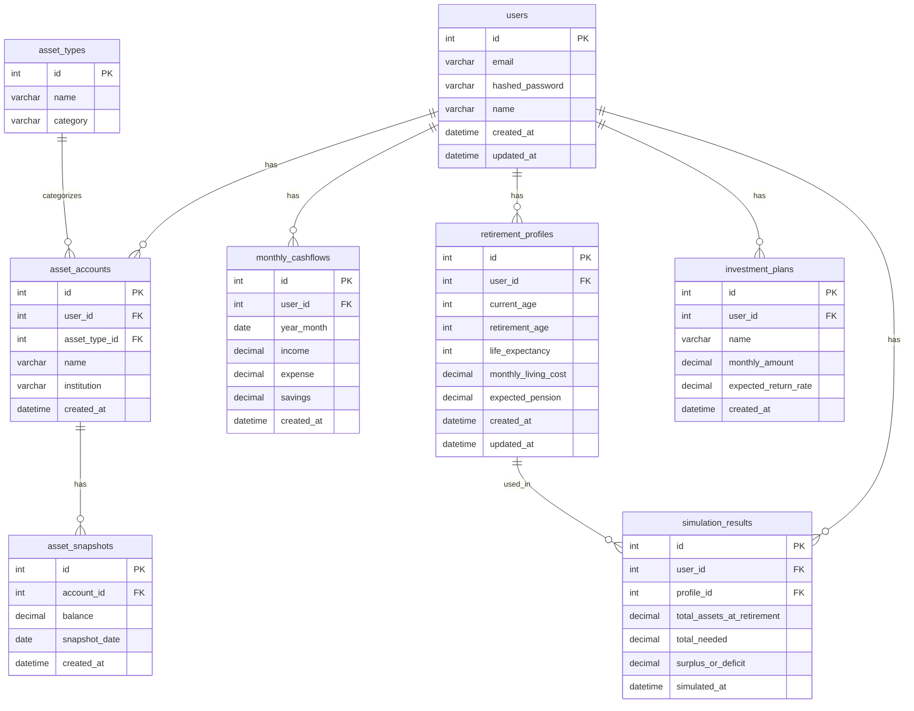

# ER図・テーブル設計

## 概要

老後資産シミュレーションを目的とした資産管理アプリのデータベース設計です。

現在は初期土台の段階であり、テーブルは未作成です。今後の開発で順次追加・変更していく予定です。

## テーブル一覧

| テーブル名 | 説明 |
|---|---|
| users | ユーザー情報 |
| asset_types | 資産種別マスタ（預金、株式、投資信託など） |
| asset_accounts | 資産口座（銀行口座、証券口座など） |
| asset_snapshots | 資産残高のスナップショット（月次記録） |
| monthly_cashflows | 月次収支（収入・支出・積立額） |
| retirement_profiles | 老後条件プロファイル |
| investment_plans | 積立・投資プラン |
| simulation_results | シミュレーション結果 |

## ER図

## 備考

- この設計は初期段階のものであり、今後の開発に応じて変更される可能性があります
- マイグレーションは将来 Alembic で管理する予定です
- テーブル間のリレーションは上記 ER 図を基本としますが、要件に応じて調整します
